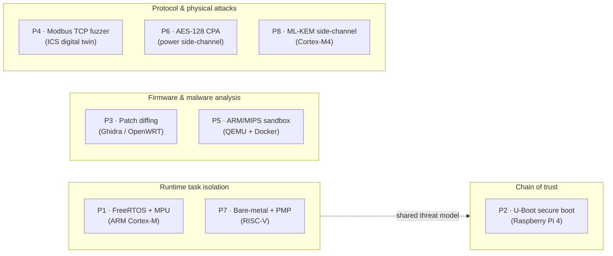
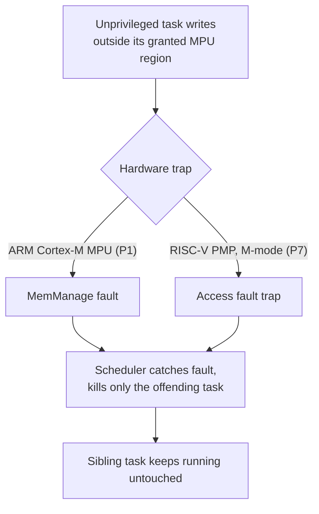
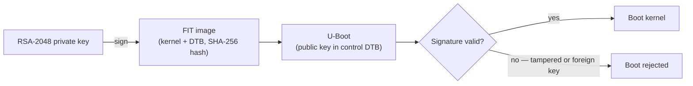
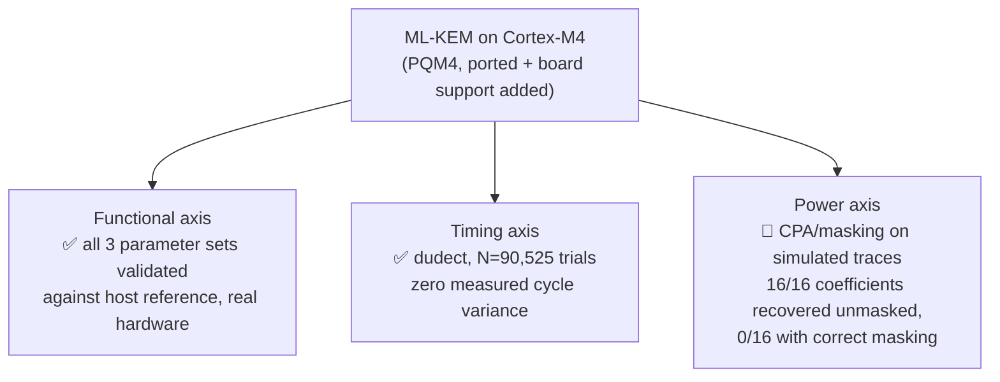

# Embedded Security — Research & Engineering Projects

> Travaux pratiques en sécurité des systèmes embarqués, couvrant la sécurité hardware, l'analyse de firmware, les protocoles industriels et la cryptographie physique.

**Amadou Tidiane Anne** · Master Logiciels et Systèmes Embarqués · UBO Brest
[](https://hal.science/hal-05486729v1)
[](https://doi.org/10.5281/zenodo.22313704)
[](LICENSE)

Eight self-contained projects, each with its own real (hardware or physics-based digital-twin) validation rather than a toy demo. Every claim below is checked against something outside the code itself — a fault caught on real silicon, a signature independently re-verified with `openssl`, a CVE cross-referenced, a statistical test on real trace data — see each project's own README for the exact methodology and evidence.

## Map



| # | Project | Domain | Real-world validation | Stack |
|---|---|---|---|---|
| P1 | [FreeRTOS Hardened on STM32](./freertos-stm32) | Runtime task isolation | ✅ Real MemManage fault on real hardware | `C` `FreeRTOS` `MPU` `mbedTLS` |
| P2 | [Secure Boot & Chain of Trust](./secure-boot) | Boot integrity | ✅ Real Raspberry Pi 4, 2 attacks confirmed rejected | `U-Boot FIT` `RSA-2048` `PKI` |
| P3 | [IoT Firmware Patch Diffing](./patch-diffing) | Reverse engineering | ✅ Real OpenWRT firmware, 1 confirmed CVE | `Ghidra` `PyGhidra` `Binwalk` |
| P4 | [Modbus TCP Grammar Fuzzer](./fuzzer-modbus) | ICS / SCADA | ✅ Real ICS attack class reproduced on digital-twin PLC | `Scapy` `pymodbus` `ICS/SCADA` |
| P5 | [ARM Malware Analysis Sandbox](./sandbox-arm) | Dynamic analysis | ✅ Real ARM/MIPS/PPC samples, MITRE ATT&CK mapping | `QEMU` `Flask` `Docker` |
| P6 | [AES-128 Side-Channel Attack](./side-channel) | Power side-channel | 🔬 Simulated leakage model — oscilloscope access pending | `numpy` `CPA` `AES-128` |
| P7 | [RISC-V PMP Task Isolation](./riscv-pmp-isolation) | Runtime task isolation | 🔬 Validated in QEMU — hardware board pending | `RISC-V` `PMP` `QEMU` |
| P8 | [ML-KEM (Kyber) Side-Channel on STM32](./kyber-sca) | PQC side-channel | ✅ Real Cortex-M4 (functional + timing) / 🔬 simulated (power) | `PQM4` `ML-KEM` `dudect` |

✅ = checked against real hardware, real firmware, or a real reference dataset · 🔬 = validated in simulation/QEMU, hardware step identified and pending.

---

## Projects

### 🔒 P1 — FreeRTOS Hardened on STM32
Multitask RTOS system with MPU memory isolation, hardware watchdog and authenticated UART communication on ARM Cortex-M. An unprivileged task deliberately writing outside its granted region triggers a real, caught MemManage fault on real hardware — verified against the linked ELF's own symbol table, not just observed — after which the board resets and resumes stable operation.



`C` `FreeRTOS` `STM32` `MPU` `mbedTLS` `OpenOCD` — [→ full writeup](./freertos-stm32)

---

### 🛡️ P2 — Secure Boot & Chain of Trust
FIT image signing for a Raspberry Pi 4 boot chain — kernel and device tree hashed (SHA-256) and signed (RSA-2048), trusted public key embedded in U-Boot's control DTB. Independently re-verified with openssl/fdtget outside of U-Boot, including two attack scenarios (tampering, re-signing with a foreign key) confirmed rejected.



`U-Boot FIT` `RSA-2048` `OpenSSL` `PKI` `Docker` — [→ full writeup](./secure-boot)

---

### 🔍 P3 — IoT Firmware Patch Diffing
Compares two OpenWRT firmware versions at the function level via Ghidra (headless, PyGhidra), pinpointing exactly which functions changed and why. One confirmed CVE (stored XSS in LuCI) plus an undocumented `libuclient` fix found and reverse-engineered from the binary diff alone.

`Python` `Ghidra` `PyGhidra` `Binwalk` `MIPS` — [→ full writeup](./patch-diffing)

---

### ⚡ P4 — Modbus TCP Grammar Fuzzer
Grammar-based fuzzer targeting Modbus TCP against a physics-based digital-twin PLC (water tank). Mutation engine plus a targeted unauthenticated-write attack that reproduces a real ICS dataset's most severe attack class end-to-end (triggers a real low-level safety alarm on the simulated PLC).

`Python` `Scapy` `pymodbus` `ICS/SCADA` `Modbus` — [→ full writeup](./fuzzer-modbus)

---

### 🤖 P5 — ARM Malware Analysis Sandbox
Dynamic analysis sandbox for ARM/MIPS/PPC binaries running under instrumented QEMU in an isolated, network-disabled Docker container. Captures syscalls and network attempts, scores risk, and maps behavior to MITRE ATT&CK.

`QEMU` `Python` `Flask` `Docker` `strace` — [→ full writeup](./sandbox-arm)

---

### 📡 P6 — AES-128 Side-Channel Attack
Correlation Power Analysis (CPA) against AES-128's first-round SubBytes — full key recovery via Pearson correlation, and a first-order boolean masking countermeasure shown to defeat it. Currently validated on a simulated Hamming-weight leakage model; real oscilloscope captures pending hardware access.

`Python` `numpy` `CPA` `AES-128` `Power Analysis` — [→ full writeup](./side-channel)

---

### 🧩 P7 — RISC-V PMP Task Isolation
Comparative counterpart to P1: the same untrusted-task-isolation threat model, ported from ARM Cortex-M's MPU to RISC-V's structurally different Physical Memory Protection (PMP). A minimal M-mode round-robin scheduler reconfigures PMP on every context switch between two sibling U-mode tasks; one deliberately corrupts the other's memory once scheduled, the scheduler catches and kills only the offender, and the sibling keeps running untouched — verified against the linked ELF's own symbol table, not just observed. Validated in QEMU; real hardware validation is next, pending a RISC-V board.

`RISC-V` `C` `QEMU` `PMP` — [→ full writeup](./riscv-pmp-isolation)

---

### 🔑 P8 — ML-KEM (Kyber) Side-Channel Analysis on STM32
Post-quantum KEM side-channel evaluation, extending P6's methodology from AES-128 to ML-KEM, along three axes:



Functional: [PQM4](https://github.com/mupq/pqm4) ported to a Cortex-M4 Nucleo-F411RE (forked, board support added upstream doesn't have), with two real on-hardware bugs found and fixed along the way (a clock config hanging on an absent external oscillator, an intermittent wrong-address flash write). Power axis: the CPA/masking analysis pipeline (coefficient-wise attack on ML-KEM's NTT-domain pointwise multiplication) is built and validated against simulated traces — real power trace acquisition is still pending measurement equipment. Timing axis needs no such equipment (only the Cortex-M4's own cycle counter), so it already has a real result — a dudect campaign (N=90,525 real trials, Welch's t-test) found *zero* measured cycle-count variance on `crypto_kem_dec` between valid and invalid ciphertexts, checked against a control measurement (keypair generation) that does show real variance, ruling out a broken measurement harness as the explanation.

`C` `Python` `PQM4` `ML-KEM` `Cortex-M4` `Power Analysis` `Timing Analysis` `dudect` — [→ full writeup](./kyber-sca)

---

## Research

**Analyse de la pertinence des métriques système natives pour la détection d'anomalies sous Linux en environnements contraints**
Prépublication HAL — Janvier 2026
→ [hal.science/hal-05486729v1](https://hal.science/hal-05486729v1) · the collector at the core of this work is also published as a standalone package: [linux-proc-anomaly](https://github.com/AmadouAnne/linux-proc-anomaly)

**Isolating Untrusted Tasks on Constrained Embedded Systems: A Comparative Study of ARM Cortex-M MPU and RISC-V PMP, with Real-Hardware Validation**
Working paper — from [P1](./freertos-stm32) and [P7](./riscv-pmp-isolation)
→ French draft: [papers/mpu-vs-pmp-isolation/paper.md](./papers/mpu-vs-pmp-isolation/paper.md)
→ English, ACM format: [anne-mpu-pmp-task-isolation-2026.pdf](./papers/mpu-vs-pmp-isolation/acm/anne-mpu-pmp-task-isolation-2026.pdf) ([source](./papers/mpu-vs-pmp-isolation/acm/anne-mpu-pmp-task-isolation-2026.tex))
→ Also deposited on HAL (pending moderation at time of writing)

**Code archive**
This repository is archived on Zenodo with a permanent, version-independent DOI: [10.5281/zenodo.22313704](https://doi.org/10.5281/zenodo.22313704) (always resolves to the latest release; the current release is [v1.1](https://doi.org/10.5281/zenodo.22313740)).

---

## Stack

```
Languages  : C · Python · Bash · Assembly (MIPS, RISC-V)
Hardware   : STM32 Nucleo-F411RE · Raspberry Pi 4 · RISC-V (QEMU virt, hardware pending)
Security   : Ghidra (PyGhidra) · Binwalk · OpenSSL · mbedTLS
Embedded   : FreeRTOS-MPU · U-Boot (FIT) · QEMU-user · QEMU-system-riscv · OpenOCD · RISC-V PMP
Protocols  : Modbus TCP
```

---

If something here is useful to you — as a reference, a starting point, or a methodology to reuse — a star helps others find it too.

[](https://star-history.com/#AmadouAnne/embedded-security&Date)
